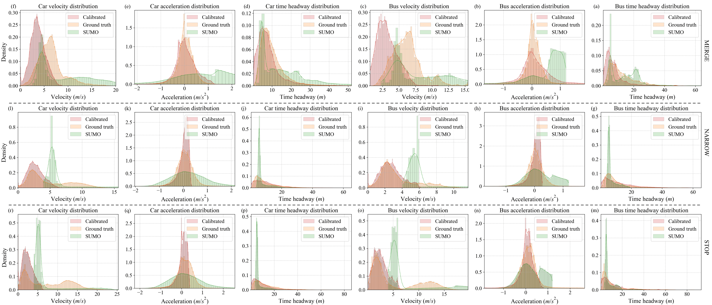

# SUMO Bayesian Calibration System: Traffic Simulation Parameter Calibration Based on Multi-Objective Optimization

[](https://www.python.org/)
[](https://sumo.dlr.de/)
[](LICENSE)

> **Note**: This is the background traffic flow data calibration code for the paper "[RiskDreamer: Autonomous Driving via Entropy-Risk Balancing Action Expansion in Batch Planning with Trusted Traffic Simulations](https://github.com/Gaochengzhi/RiskDreamer)".

### Author Information

<p align="center"><em>Jiangsu University &amp; Nanyang Technological University</em></p>

<p align="center"><em>Qingchao Liu, Chengzhi Gao, Xiangkun He, Hai Wang, Chen Lv, Yingfeng Cai, Long Chen</em></p>

*For Chinese documentation, please refer to [README_zh.md](README_zh.md)*

## Introduction

This research proposes a method based on driver model parameter calibration. The method iteratively optimizes by calibrating the parameter probability distributions of typical driver models such as EIDM and LC2015, making the generated trajectories reduce the differences with real vehicle trajectory datasets in aggregate distributions of key behavioral features such as velocity, acceleration, and headway distance. The closed-loop traffic scenarios constructed thereby significantly improve the trustworthiness of background traffic interactions.

### System Framework

<p align="center" style="background-color: #fff;">
    
</p>

*Trusted Closed-Loop Traffic Scene Generation Framework*

### Simulation Scenarios

  
*Three calibration scenarios: (a) Merge scenario, (b) Stop-and-yield scenario, (c) Right-turn scenario*

## Results Preview

### Simulation Effect Comparison

|                            Calibrated Simulation                            |                                 Real Data                                 |                               Original SUMO                               |
| :-------------------------------------------------------------------------: | :-----------------------------------------------------------------------: | :-----------------------------------------------------------------------: |
|  |  |  |

### Optimization Convergence Process


*KL Divergence Convergence Comparison of Multi-Objective Optimization Algorithms*

### Parameter Distribution Calibration Results


*Comparison of Parameter Distributions Before and After Calibration with Real Data*

## Table of Contents

- [Quick Start](#quick-start)
  - [Install Dependencies](#install-dependencies)
  - [Data Preparation](#data-preparation)
- [Usage Guide](#usage-guide)
  - [Complete Calibration Process](#complete-calibration-process)
  - [Running Individual Components](#running-individual-components)
- [Project Structure](#project-structure)
- [Visualization Analysis](#visualization-analysis)

## Quick Start

### Install Dependencies

#### Method 1: Using uv (Recommended)

```bash
# Install uv package manager
curl -LsSf https://astral.sh/uv/install.sh | sh

# Create Python 3.10 environment
uv python install 3.10
uv venv --python 3.10

# Activate environment
source .venv/bin/activate  # Linux/Mac
# or .venv\Scripts\activate  # Windows

# Install dependencies
uv pip install -r requirements.txt
```

#### Method 2: Using pip

```bash
# Create virtual environment
python -m venv venv
source venv/bin/activate  # Linux/Mac
# or venv\Scripts\activate  # Windows

# Install dependencies
pip install -r requirements.txt
```

### SUMO Environment Configuration

1. **Configure Environment Variables**
   ```bash
   export SUMO_HOME="/usr/share/sumo"  # Adjust according to actual installation path
   export PATH="$SUMO_HOME/bin:$PATH"
   ```

2. **Modify Scenario Configuration**
   ```bash
   # Update default SUMO_HOME paths in each scenario
   env/merge/autoGenTraffic.sh
   env/stop/autoGenTraffic.sh  
   env/right/autoGenTraffic.sh
   ```

### Data Preparation

To recalibrate from raw data, place the AD4CHE dataset in the `data/` directory:

```
data/
├── AD4CHE_boundingbox.mp4
└── DJI_0001/ ~ DJI_0065/
    ├── DJI_0001.mp4
    ├── DJI_0002.mp4
    └── ...
```

## Usage Guide

### Complete Calibration Process

```bash
# Enter source code directory
cd src

# Run complete three-step calibration process
python main.py
```

**Execution Process:**
1. **Data Preprocessing**: Calculate real data distributions for 3 scenarios
2. **Bayesian Optimization**: Execute 3000 iterations of optimization for each scenario
3. **Multi-Objective Optimization**: Use PSO, NSGA-III, AGE-MOEA2 algorithms

### Running Individual Components

```bash
# Run Bayesian optimization only
python bayesian_optimize.py

# Run multi-objective optimization only
python multi_object_optimization.py

# Data processing and analysis
python process_data.py

# Result visualization
python render_plot.py

# Evaluate specific scenarios
python task.py
```

### Output Files Description

After completion, the following files will be generated:

```
output/
├── data_cache/           # Optimization result cache
│   ├── merge_*.pkl      # Merge scenario results
│   ├── stop_*.pkl       # Stop scenario results
│   └── right_*.pkl      # Right turn scenario results
├── data_raw/            # Raw simulation data
├── frames/              # Visualization frame files
└── plot/                # Analysis charts

log/
├── merge.log            # Merge scenario optimization log
├── stop.log             # Stop scenario optimization log
└── right.log            # Right turn scenario optimization log
```

## Project Structure

```
sumo_bayesian_calibration/
├── src/                              # Core Code
│   ├── main.py                      # Main program entry, coordinates complete calibration process
│   ├── task.py                      # SUMO task management and simulation wrapper
│   ├── highway_env.py               # SUMO environment interface and data recording
│   ├── bayesian_optimize.py         # Bayesian optimization implementation
│   ├── multi_object_optimization.py # Multi-objective optimization algorithms
│   ├── process_data.py              # Data processing and KL divergence calculation
│   ├── render_plot.py               # Result visualization generation
│   ├── eval.py                      # Model evaluation tools
│   └── util.py                      # Common utility functions
├── visualize_result/                 # Result Visualization
│   ├── chinese_visualize.ipynb      # Chinese visualization analysis
│   ├── visualize_en.ipynb           # English visualization analysis
│   └── visualize_road.ipynb         # Road scenario visualization
├── env/                             # Simulation Environment Configuration
│   ├── merge/                       # Merge scenario (frames 1-8)
│   ├── stop/                        # Stop scenario (frames 15-16)
│   └── right/                       # Right turn scenario (frames 18-23)
├── data/                            # Raw Data
│   ├── AD4CHE_boundingbox.mp4       # Annotated video
│   └── DJI_0001/ ~ DJI_0065/        # Raw video files
├── output/                          # Output Results
│   ├── data_cache/                  # Optimization result cache (.pkl)
│   ├── data_raw/                    # Raw simulation data
│   ├── frames/                      # Visualization frame files
│   └── plot/                        # Analysis charts
├── log/                             # Optimization Logs
├── requirements.txt                 # Dependency package list
├── README.md                        # English documentation
└── README_zh.md                     # Chinese documentation
```

## Visualization Analysis

The project provides various visualization analysis tools:

### Jupyter Notebook Analysis

```bash
# Start Jupyter
jupyter visualize_result/*_file.ipynb
```
### Links:
- [chinese_visualize.ipynb](visualize_result/chinese_visualize.ipynb)    # Chinese detailed analysis
- [visualize_en.ipynb](visualize_result/visualize_en.ipynb)              # English version analysis  
- [visualize_road.ipynb](visualize_result/visualize_road.ipynb)          # Road scenario visualization


### Main Visualization Content

1. **Optimization Convergence Curves**: KL divergence changes for different algorithms
2. **Parameter Distribution Comparison**: Parameter distribution changes before and after calibration
3. **Trajectory Comparison**: Real data vs simulation data trajectories
4. **Scenario Animation**: Dynamic display of three traffic scenarios