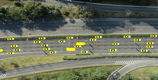
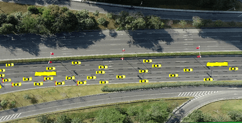

# SUMO贝叶斯校准系统：基于多目标优化的交通仿真参数标定

[](https://www.python.org/)
[](https://sumo.dlr.de/)
[](LICENSE)

> **注意**：这是论文["RiskDreamer: Autonomous Driving via Entropy-Risk Balancing Action Expansion in Batch Planning with Trusted Traffic Simulations"](https://github.com/Gaochengzhi/RiskDreamer)的背景交通流数据校准部分代码。

### 作者信息

<p align="center"><em>江苏大学 & 南洋理工大学</em></p>
<p align="center"><em>Qingchao Liu, Chengzhi Gao, Xiangkun He, Hai Wang, Chen Lv, Yingfeng Cai, Long Chen</em></p>

## 简介


本研究提出了一种基于驾驶员模型参数校准的方法。该方法通过校准EIDM、LC2015等典型驾驶员模型的参数概率分布进行迭代优化，使所生成轨迹在速度、加速度、车头时距等关键行为特征的聚合分布上，与真实车辆轨迹数据集缩小差异。由此构建的闭环交通场景显著提升了背景交通交互的可信度.


### 系统框架

<p align="center" style="background-color: #fff;">
    
</p>

*可信闭环交通场景生成框架*

### 仿真场景

  
*三种校准场景：(a) 汇流场景，(b) 停车让行场景，(c) 右转场景*


## 结果预览

### 仿真效果对比

|                                 校准后仿真                                  |                                 真实数据                                  |                                 原始SUMO                                  |
| :-------------------------------------------------------------------------: | :-----------------------------------------------------------------------: | :-----------------------------------------------------------------------: |
|  |  |  |

### 优化收敛过程


*多目标优化算法的KL散度收敛对比*

### 参数分布校准结果


*校准前后参数分布与真实数据的对比*

## 📋 目录

- [🚀 快速开始](#-快速开始)
  - [环境要求](#环境要求)
  - [安装依赖](#安装依赖)
  - [数据准备](#数据准备)
- [💻 使用指南](#-使用指南)
  - [完整校准流程](#完整校准流程)
  - [单独运行组件](#单独运行组件)
- [📁 项目结构](#-项目结构)
- [⚙️ 参数配置](#️-参数配置)
- [🔬 可视化分析](#-可视化分析)
- [📄 许可证](#-许可证)


## 快速开始


### 安装依赖

#### 方式1：使用uv（推荐）

```bash
# 安装uv包管理器
curl -LsSf https://astral.sh/uv/install.sh | sh

# 创建Python 3.10环境
uv python install 3.10
uv venv --python 3.10

# 激活环境
source .venv/bin/activate  # Linux/Mac
# 或 .venv\Scripts\activate  # Windows

# 安装依赖
uv pip install -r requirements.txt
```

#### 方式2：使用pip

```bash
# 创建虚拟环境
python -m venv venv
source venv/bin/activate  # Linux/Mac
# 或 venv\Scripts\activate  # Windows

# 安装依赖
pip install -r requirements.txt
```

### SUMO环境配置

1. **配置环境变量**
   ```bash
   export SUMO_HOME="/usr/share/sumo"  # 根据实际安装路径调整
   export PATH="$SUMO_HOME/bin:$PATH"
   ```

2. **修改场景配置**
   ```bash
   # 更新各场景的默认SUMO_HOME路径
   env/merge/autoGenTraffic.sh
   env/stop/autoGenTraffic.sh  
   env/right/autoGenTraffic.sh
   ```

### 数据准备

如需从原始数据重新校准，请将AD4CHE数据集放置在`data/`目录：

```
data/
├── AD4CHE_boundingbox.mp4
└── DJI_0001/ ~ DJI_0065/
    ├── DJI_0001.mp4
    ├── DJI_0002.mp4
    └── ...
```

## 使用指南

### 完整校准流程

```bash
# 进入源码目录
cd src

# 运行完整三步校准流程
python main.py
```

**执行流程：**
1. **数据预处理**：计算3个场景的真实数据分布
2. **贝叶斯优化**：每个场景执行3000次迭代优化
3. **多目标优化**：使用PSO、NSGA-III、AGE-MOEA2算法

### 单独运行组件

```bash
# 仅运行贝叶斯优化
python bayesian_optimize.py

# 仅运行多目标优化  
python multi_object_optimization.py

# 数据处理和分析
python process_data.py

# 结果可视化
python render_plot.py

# 评估特定场景
python task.py
```

### 输出文件说明

运行完成后将生成以下文件：

```
output/
├── data_cache/           # 优化结果缓存
│   ├── merge_*.pkl      # 汇流场景结果
│   ├── stop_*.pkl       # 停车场景结果
│   └── right_*.pkl      # 右转场景结果
├── data_raw/            # 原始仿真数据
├── frames/              # 可视化帧文件
└── plot/                # 分析图表

log/
├── merge.log            # 汇流场景优化日志
├── stop.log             # 停车场景优化日志
└── right.log            # 右转场景优化日志
```

## 📁 项目结构

```
sumo_bayesian_calibration/
├── src/                              # 🔧 核心代码
│   ├── main.py                      # 主程序入口，协调完整校准流程
│   ├── task.py                      # SUMO任务管理和仿真封装
│   ├── highway_env.py               # SUMO环境接口和数据记录
│   ├── bayesian_optimize.py         # 贝叶斯优化实现
│   ├── multi_object_optimization.py # 多目标优化算法
│   ├── process_data.py              # 数据处理和KL散度计算
│   ├── render_plot.py               # 结果可视化生成
│   ├── eval.py                      # 模型评估工具
│   └── util.py                      # 通用工具函数
├── visualize_result/                 # 📊 结果可视化
│   ├── chinese_visualize.ipynb      # 中文可视化分析
│   ├── visualize_en.ipynb           # 英文可视化分析
│   └── visualize_road.ipynb         # 道路场景可视化
├── env/                             # 🚦 仿真环境配置
│   ├── merge/                       # 汇流场景 (frames 1-8)
│   ├── stop/                        # 停车场景 (frames 15-16)
│   └── right/                       # 右转场景 (frames 18-23)
├── data/                            # 📹 原始数据
│   ├── AD4CHE_boundingbox.mp4       # 标注视频
│   └── DJI_0001/ ~ DJI_0065/        # 原始视频文件
├── output/                          # 📤 输出结果
│   ├── data_cache/                  # 优化结果缓存 (.pkl)
│   ├── data_raw/                    # 原始仿真数据
│   ├── frames/                      # 可视化帧文件
│   └── plot/                        # 分析图表
├── log/                             # 📋 优化日志
├── requirements.txt                 # 依赖包列表
└── README_zh.md                     # 中文说明文档
```


## 🔬 可视化分析

项目提供多种可视化分析工具：

### Jupyter Notebook分析

```bash
# 启动Jupyter
jupyter visualize_result/*_file.ipynb
```
### Link:
- [chinese_visualize.ipynb](visualize_result/chinese_visualize.ipynb)    # 中文详细分析
- [visualize_en.ipynb](visualize_result/visualize_en.ipynb)              # 英文版本分析  
- [visualize_road.ipynb](visualize_result/visualize_road.ipynb)          # 道路场景可视化


### 主要可视化内容

1. **优化收敛曲线**：不同算法的KL散度变化
2. **参数分布对比**：校准前后参数分布变化
3. **轨迹对比**：真实数据vs仿真数据轨迹
4. **场景动画**：三种交通场景的动态展示


